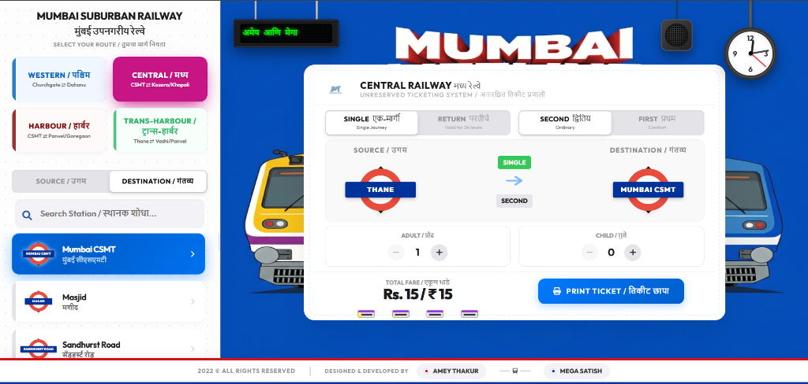
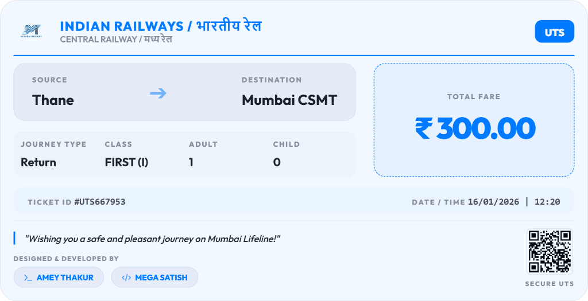

<div align="center">

  <a name="readme-top"></a>
  # ATVM Interface

  [](LICENSE)
  
  [](https://github.com/Amey-Thakur/ATVM-INTERFACE)
  [](https://github.com/Amey-Thakur/ATVM-INTERFACE)

  A simulation of the Automatic Ticket Vending Machine (ATVM) interface found at railway stations, designed with Human-Machine Interaction (HMI) principles.

  **[Source Code](Source%20Code/)** &nbsp;·&nbsp; **[Technical Specification](docs/SPECIFICATION.md)** &nbsp;·&nbsp; **[Live Demo](https://amey-thakur.github.io/ATVM-INTERFACE/)**

</div>

---

<div align="center">

  [Authors](#authors) &nbsp;·&nbsp; [Overview](#overview) &nbsp;·&nbsp; [Features](#features) &nbsp;·&nbsp; [Structure](#project-structure) &nbsp;·&nbsp; [Results](#results) &nbsp;·&nbsp; [Quick Start](#quick-start) &nbsp;·&nbsp; [Usage Guidelines](#usage-guidelines) &nbsp;·&nbsp; [License](#license) &nbsp;·&nbsp; [About](#about-this-repository) &nbsp;·&nbsp; [Acknowledgments](#acknowledgments)

</div>

---

<!-- AUTHORS -->
<div align="center">

  <a name="authors"></a>
  ## Authors

  **Terna Engineering College | Computer Engineering | Batch of 2022**

| <a href="https://github.com/Amey-Thakur"></a><br>[**Amey Thakur**](https://github.com/Amey-Thakur)<br><br>[](https://orcid.org/0000-0001-5644-1575) | <a href="https://github.com/msatmod"></a><br>[**Mega Satish**](https://github.com/msatmod)<br><br>[](https://orcid.org/0000-0002-1430-4961) |
| :---: | :---: |

</div>

> [!IMPORTANT]
> ### 🤝🏻 Special Acknowledgement
> *Special thanks to **[Mega Satish](https://github.com/msatmod)** for her meaningful contributions, guidance, and support that helped shape this work.*

---

<!-- OVERVIEW -->
<a name="overview"></a>
## Overview

The **ATVM (Automatic Ticket Vending Machine) Interface** is a user-centric digital simulation designed to optimize the commuter ticketing experience. The system streamlines the workflow for public transport access, reducing transaction time and cognitive friction through a clean, linear interface design.

### HMI Principles
The development of this interface was guided by core **Human-Machine Interaction** paradigms:
*   **Direct Manipulation**: Users interact directly with visual representations of travel zones and ticket types, reducing the abstraction gap between intent and action.
*   **Feedback**: The system provides immediate visual responsiveness (color changes, summary updates) to every user input, ensuring the user is always aware of the system state.

> [!TIP]
> **Fitts's Law in Action**
>
> The interface layout strategically sizes and places interactive buttons (like 'Book Ticket' and Map Zones) to minimize cursor travel time and maximize target acquisition accuracy. This adherence to **Fitts's Law** ensures that high-frequency actions become motor reflexes for the user, significantly speeding up the transaction process in high-volume public transport scenarios.

---

<!-- FEATURES -->
<a name="features"></a>
## Features

| Feature | Description |
|---------|-------------|
| **Semantic Layout** | Structured using HTML5 semantic tags for accessibility and clarity. |
| **State Management** | Uses AngularJS to handle data flow and view transitions without page reloads. |
| **Master-Grade Export** | **Industrial-Grade Download (v6.0)** using Base64 streams for local file compatibility. |
| **Universal Native Share** | Integrated high-compatibility Native Share API for social sharing across all devices. |
| **Expanded Station UI** | **1.8x Scaled Station Signs** and optimized layout for superior visual hierarchy. |
| **Interactive UX** | Smooth transitions, instant fare calculation, and simulated printing workflow. |
| **System Map Overlay** | LED-themed interactive transit map for network-wide orientation. |
| **Data Handling** | Client-side management of station data and ticket details. |

### Tech Stack
- **Core**: HTML5, CSS3 (Modern Flexbox/Grid), JavaScript (ES6+)
- **Logic**: AngularJS (1.x), jQuery
- **Imaging**: **html2canvas** (Custom high-fidelity capture engine)
- **UI System**: Bootstrap 3 (Customized), Font Awesome 6
- **Deployment**: GitHub Actions (Staging Workflow), GitHub Pages
- **Authorship**: Digitally signed ticket exports for **Amey & Mega** ✍️ 🚂

---

<!-- STRUCTURE -->
<a name="project-structure"></a>
## Project Structure

```python
ATVM-INTERFACE/
│
├── .github/                         # GitHub Actions & Automation
│   └── workflows/
│       └── deploy.yml               # Automated Staging & Deployment Flow
│
├── docs/                            # Technical Documentation
│   └── SPECIFICATION.md             # Architecture & Design Specification
│
├── Mega/                                                         # Archival Attribution Assets
│   ├── Filly.jpg                                                 # Companion (Filly)
│   └── Mega.png                                                  # Author Profile Image (Mega Satish)
│
├── Source Code/                     # Primary Application Layer
│   ├── css/                         # Design System & Stylesheets
│   ├── js/                          # Application Logic (AngularJS)
│   ├── images/                      # Visual Assets
│   └── index.html                   # Application Gateway
│
├── .gitattributes                   # Git configuration
├── CITATION.cff                     # Scholarly Citation Metadata
├── codemeta.json                    # Machine-Readable Project Metadata
├── LICENSE                          # MIT License Terms
├── README.md                        # Comprehensive Archival Entrance
└── SECURITY.md                      # Security Policy & Protocol
```

---

<!-- RESULTS -->
<a name="results"></a>
## Results

<div align="center">
  <b>Interface Simulation</b>
  <br><br>
  
  <br><br>
  <b>Expanded Interface Simulation</b>
  <br><br>
  
  <br><br>
  <b>Ticket Preview Modal</b>
  <br><br>
  
  <br><br>
  <b>Generated Digital Ticket</b>
  <br><br>
  
  <br><br>
  <b>Interactive System Map</b>
  <br><br>
  
</div>

---

<!-- QUICK START -->
<a name="quick-start"></a>
## Quick Start

### 1. Prerequisites
- **Browser**: Any modern standards-compliant web browser (Chrome, Firefox, Edge, Safari).
- **Environment**: No server-side runtime is required; this is a static client-side application.

> [!WARNING]
> **Local Execution**
>
> While the project can be executed by opening `index.html` directly, certain features may require an active internet connection to resolve external libraries correctly.

### 2. Setup & Deployment
1.  **Clone the Repository**:
    ```bash
    git clone https://github.com/Amey-Thakur/ATVM-INTERFACE.git
    cd ATVM-INTERFACE
    ```
2.  **Launch**:
    Open `Source Code/index.html` in your preferred browser.

---

<!-- =========================================================================================
                                     USAGE SECTION
     ========================================================================================= -->
## Usage Guidelines

This repository is openly shared to support learning and knowledge exchange across the academic community.

**For Students**  
Use this project as reference material for understanding interactive system design, web development patterns, and Human Machine Interaction principles. The source code is available for study to facilitate self-paced learning and exploration of user-centric design patterns.

**For Educators**  
This project may serve as a practical lab example or supplementary teaching resource for Human Machine Interaction and Human Machine Interaction Laboratory courses (`CSC801` & `CSL801`). Attribution is appreciated when utilizing content.

**For Researchers**  
The documentation and design approach may provide insights into academic project structuring and interactive web application development.

---

<!-- LICENSE -->
<a name="license"></a>
## License

This repository and all its creative and technical assets are made available under the **MIT License**. See the [LICENSE](LICENSE) file for complete terms.

> [!NOTE]
> **Summary**: You are free to share and adapt this content for any purpose, even commercially, as long as you provide appropriate attribution to the original authors.

Copyright © 2022 Amey Thakur & Mega Satish

---

<!-- ABOUT -->
<a name="about-this-repository"></a>
## About This Repository

**Created & Maintained by**: [Amey Thakur](https://github.com/Amey-Thakur) & [Mega Satish](https://github.com/msatmod)  
**Academic Journey**: Bachelor of Engineering in Computer Engineering (2018-2022)  
**Institution**: [Terna Engineering College](https://ternaengg.ac.in/), Navi Mumbai  
**University**: [University of Mumbai](https://mu.ac.in/)

This project features the **ATVM Interface**, developed as a **Human Machine Interaction** project during the **8th Semester Computer Engineering** curriculum. It showcases the use of web technologies to build interactive, simulation-based digital experiences.

**Connect:** [GitHub](https://github.com/Amey-Thakur) &nbsp;·&nbsp; [LinkedIn](https://www.linkedin.com/in/amey-thakur) &nbsp;·&nbsp; [ORCID](https://orcid.org/0000-0001-5644-1575)

### Acknowledgments

Grateful acknowledgment to [**Mega Satish**](https://github.com/msatmod) for her exceptional collaboration and scholarly partnership during the development of this interface simulation. Her constant support, technical clarity, and dedication to software quality were instrumental in achieving the system's functional objectives. Learning alongside her was a transformative experience; her thoughtful approach to problem-solving and steady encouragement turned complex requirements into meaningful learning moments. This work reflects the growth and insights gained from our side-by-side academic journey. Thank you, Mega, for everything you shared and taught along the way.

Grateful acknowledgment to the faculty members of the **Department of Computer Engineering** at Terna Engineering College for their guidance and instruction in Human Machine Interaction. Their expertise and support helped develop a strong understanding of interactive system design.

Special thanks to the **mentors and peers** whose encouragement, discussions, and support contributed meaningfully to this learning experience.

---

<div align="center">

  [↑ Back to Top](#readme-top)

  [Authors](#authors) &nbsp;·&nbsp; [Overview](#overview) &nbsp;·&nbsp; [Features](#features) &nbsp;·&nbsp; [Structure](#project-structure) &nbsp;·&nbsp; [Results](#results) &nbsp;·&nbsp; [Quick Start](#quick-start) &nbsp;·&nbsp; [Usage Guidelines](#usage-guidelines) &nbsp;·&nbsp; [License](#license) &nbsp;·&nbsp; [About](#about-this-repository) &nbsp;·&nbsp; [Acknowledgments](#acknowledgments)

  <br>

  🔬 **[Human Machine Interaction Laboratory](https://github.com/Amey-Thakur/HUMAN-MACHINE-INTERACTION-AND-HUMAN-MACHINE-INTERACTION-LAB)** &nbsp; · &nbsp; 🎫 **[ATVM-INTERFACE](https://amey-thakur.github.io/ATVM-INTERFACE)**

  ---

  ### 🎓 [Computer Engineering Repository](https://github.com/Amey-Thakur/COMPUTER-ENGINEERING)

  **Computer Engineering (B.E.) - University of Mumbai**

  *Semester-wise curriculum, laboratories, projects, and academic notes.*

</div>
