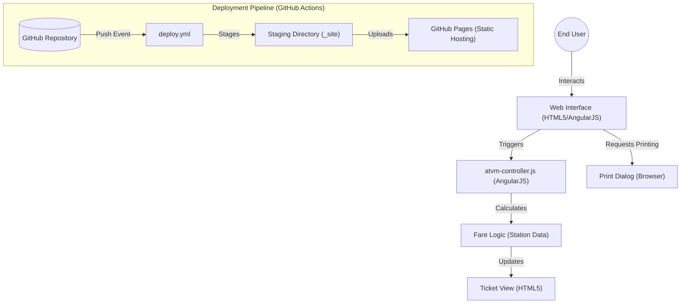

# ATVM | Interface

## Architectural Overview

**ATVM-INTERFACE** is a semantic HTML5, CSS3, and AngularJS-based static web application designed to simulate an Automated Ticket Vending Machine (ATVM) interface for the Mumbai Metro. The system prioritizes responsive design, client-side logic for fare calculation, and a user-friendly interface for station selection and ticket generation.

### Process & Interaction Flow Diagram

---

## Technical Implementations

### 1. Structure Layer: Semantic HTML5 & AngularJS
The application uses AngularJS for dynamic data binding and user interaction.
-   **Dynamic Data Binding**: Leverages AngularJS directives like `ng-repeat`, `ng-click`, and `ng-class` to manage station lists and selection states.
-   **Client-Side Logic**: Fare calculation and ticket management are handled entirely on the client side without needing a backend.

### 2. Style Layer: Bootstrap & Custom CSS
The visual identity is managed through Bootstrap and a centralized custom stylesheet (`atvm.css`).
-   **Responsive Grid**: Uses Bootstrap’s grid system to ensure compatibility across various screen sizes.
-   **Thematic Styling**: Custom CSS handles more granular styling, such as the ticket appearance and background images.

### 3. Deployment Layer: GitHub Actions
Automated deployment ensures that the production site is always synchronized with the `Source Code` directory.
-   **Staging Workflow**: The `deploy.yml` workflow stages repository contents into a clean `_site` directory before artifact upload, ensuring the site is served from the `Source Code` folder.

---

## Technical Prerequisites

-   **Runtime**: Any modern standards-compliant web browser.
-   **Frameworks**: AngularJS 1.x, jQuery 1.11.0, Bootstrap 3.x (included in dependencies).
-   **Hosting**: GitHub Pages for CI/CD functionality.

---

*Technical Specification | Computer Engineering Project | Version 1.0*
