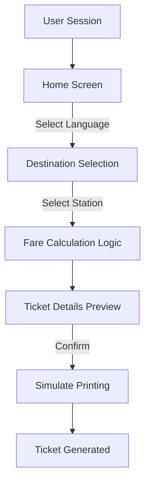

# Technical Specification: ATVM | Interface

## Architectural Overview

The **ATVM Interface** repository is a simulation of the Automatic Ticket Vending Machine (ATVM) interface used in railway stations. The system is designed to provide a realistic, user-friendly digital experience that replicates the workflow of purchasing railway tickets, adhering to Human-Machine Interaction (HMI) principles.

### User Interaction Flow

---

## Technical Implementations

### 1. Frontend Architecture
The application is built as a Single Page Application (SPA) or a responsive web interface using standard web technologies:
-   **Structure**: Semantic HTML5 is used to define the layout and content hierarchy, ensuring accessibility and clarity.
-   **Styling**: CSS3 and Bootstrap framework are employed to create a responsive, grid-based layout that adapts to various screen dimensions, simulating the touch-interface of a physical kiosk.

### 2. Application Logic
-   **State Management**: AngularJS (1.x) takes precedence in managing the application state. It handles the data flow between the view and the model, ensuring that user inputs (like station selection) instantly update the fare and ticket details without page reloads.
-   **Data Handling**: Station data and fare structures are managed within the client-side logic, allowing for instant feedback.

### 3. Deployment Pipeline
-   **CI/CD**: The project adheres to a continuous deployment model using **GitHub Actions**. Any changes pushed to the `main` branch trigger a workflow that deploys the application to **GitHub Pages**, ensuring the live interface is always up-to-date.

---

## Technical Prerequisites

-   **Runtime Environment**: Any modern web browser (Chrome, Firefox, Edge, Safari).
-   **Development Requirements**: A standard code editor (VS Code) and git for version control. No complex backend setup is required as the logic is client-side.

---

*Technical Specification | Human Machine Interaction | Version 1.0*
